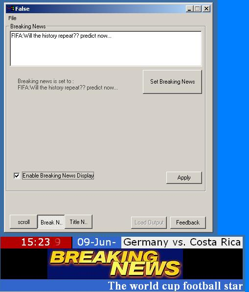



## Flash news display manager

### Description

This code creates text effects,text animations using DHTML and diplays flash news like in tv channels.All the configuarations can be done at run time from a vb form.Tuned for scroll news and breaking news displays as well.Plz make sure that IE6 is in use.
 
### More Info
 
a seperate form is used as the contro panel

text animation in vb

             |
---                |---
**Submitted On**   |2006-06-09 16:48:08
**By**             |[vineeshkumar](https://github.com/Planet-Source-Code/PSCIndex/blob/master/ByAuthor/vineeshkumar.md)
**Level**          |Intermediate
**User Rating**    |4.8 (24 globes from 5 users)
**Compatibility**  |VB 6\.0
**Category**       |[Graphics](https://github.com/Planet-Source-Code/PSCIndex/blob/master/ByCategory/graphics__1-46.md)
**World**          |[Visual Basic](https://github.com/Planet-Source-Code/PSCIndex/blob/master/ByWorld/visual-basic.md)
**Archive File**   |[Flash\_news2000376122006\.zip](https://github.com/Planet-Source-Code/vineeshkumar-flash-news-display-manager__1-65607/archive/master.zip)

